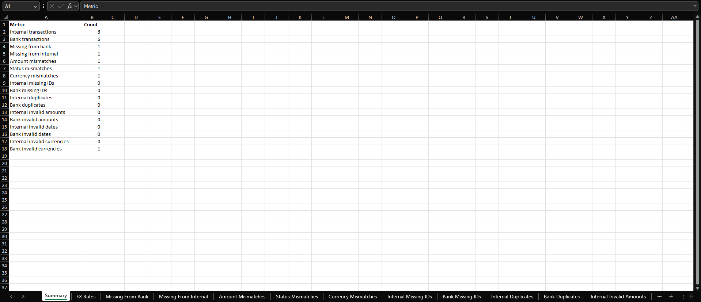

# Transaction Reconciliation Automation

A Python-based automation project that compares internal transaction records with bank transaction records, validates input data, identifies discrepancies, and generates a structured Excel reconciliation report.

This project was built to simulate a real-world financial operations automation workflow.

## Business Problem

Financial operations teams often need to compare transaction data from multiple systems to confirm that records match correctly.

Performing this process manually can be:

- repetitive
- time-consuming
- prone to human error
- difficult to scale as transaction volume increases

The goal of this project is to automate the reconciliation process and allow an analyst to focus only on transactions that require investigation.

## Solution

The application loads transaction data from two CSV files:

- internal transaction records
- bank transaction records

It then validates the input data, reconciles transactions using their transaction IDs, identifies exceptions, and generates an Excel report containing the reconciliation results.

## Features

The application currently supports:

- CSV transaction data loading
- required-column validation
- missing transaction ID detection
- duplicate transaction ID detection
- invalid amount detection
- invalid date detection
- currency normalization and validation
- transaction matching by transaction ID
- detection of transactions missing from bank records
- detection of transactions missing from internal records
- amount mismatch detection
- status mismatch detection
- currency mismatch detection
- exchange-rate retrieval through an external REST API
- graceful handling of exchange-rate API failures
- reconciliation summary generation
- multi-sheet Excel report generation
- automatic Excel column sizing
- frozen Excel header rows
- logging and basic error handling
- automated testing with pytest

## Example Reconciliation

The sample datasets intentionally contain several exceptions so that the automation can demonstrate its validation and reconciliation capabilities.

Example issues include:

| Transaction | Issue |
|---|---|
| TX003 | Amount mismatch |
| TX005 | Missing from bank records |
| TX006 | Status mismatch |
| TX007 | Missing from internal records |
| Sample transaction | Currency mismatch |
| Sample bank record | Invalid currency |

The exact sample values are synthetic and are included only for demonstration purposes.

## Reconciliation Workflow

```text
Internal Transactions        Bank Transactions
          │                         │
          └──────────┬──────────────┘
                     │
                     ▼
               Load CSV Files
                     │
                     ▼
            Validate Input Data
                     │
                     ▼
           Normalize Currencies
                     │
          ┌──────────┴──────────┐
          ▼                     ▼
   Validation Results      Fetch FX Rates
          │                     │
          └──────────┬──────────┘
                     ▼
          Match Transaction IDs
                     │
                     ▼
           Compare Transactions
                     │
       ┌─────────────┼─────────────┐
       ▼             ▼             ▼
    Missing        Amount       Status /
 Transactions    Mismatches     Currency
                               Mismatches
                     │
                     ▼
              Generate Report
                     │
                     ▼
        reconciliationReport.xlsx
```

## Project Structure

```text
TransactionReconciliationAutomation/
│
├── data/
│   ├── internalTransactions.csv
│   └── bankTransactions.csv
│
├── docs/
│   ├── images/
│   │   └── reconciliationSummary.png
│   ├── processFlow.md
│   ├── requirements.md
│   └── solutionDesign.md
│
├── src/
│   ├── __init__.py
│   ├── exchange_rates.py
│   ├── loader.py
│   ├── main.py
│   ├── reconciler.py
│   ├── report.py
│   └── validator.py
│
├── tests/
│   ├── test_exchange_rates.py
│   └── test_reconciliation.py
│
├── output/
│
├── .gitignore
├── README.md
└── requirements.txt
```

## Module Responsibilities

### `loader.py`

Responsible for loading transaction files into pandas DataFrames.

### `exchange_rates.py`

Responsible for:

- retrieving exchange rates from an external REST API
- normalizing requested currency codes
- handling API and network failures through a custom exception

### `validator.py`

Contains input validation logic including:

- required columns
- missing transaction IDs
- duplicate IDs
- invalid amounts
- invalid dates
- currency normalization
- invalid currency detection

### `reconciler.py`

Contains the main reconciliation logic including:

- transaction matching
- missing transaction detection
- amount mismatch detection
- status mismatch detection
- currency mismatch detection

### `report.py`

Responsible for:

- generating reconciliation summaries
- exporting results to Excel
- formatting Excel worksheets

### `main.py`

Coordinates the complete workflow.

## Technologies Used

- Python
- pandas
- openpyxl
- requests
- pytest
- Git
- GitHub

## Setup

### 1. Clone the repository

```bash
git clone https://github.com/ArijusK/transactionReconciliationAutomation.git
```

### 2. Enter the project directory

```bash
cd transactionReconciliationAutomation
```

### 3. Create a virtual environment

```bash
python -m venv .venv
```

### 4. Activate the virtual environment

On Windows:

```bash
.venv\Scripts\activate
```

### 5. Install dependencies

```bash
python -m pip install -r requirements.txt
```

## Running the Application

From the project root directory, run:

```bash
python -m src.main
```

The application will:

1. load both transaction files
2. validate and normalize the input data
3. retrieve relevant exchange rates
4. reconcile transactions
5. identify exceptions
6. print a reconciliation summary
7. generate an Excel report

The generated report is saved to:

```text
output/reconciliationReport.xlsx
```

## Excel Report

The generated Excel report contains:

- a reconciliation summary
- current FX rates
- missing transaction reports
- amount mismatch reports
- status mismatch reports
- currency mismatch reports
- transaction ID validation results
- duplicate transaction reports
- invalid amount reports
- invalid date reports
- invalid currency reports

The Excel report includes bold headers, automatic column sizing, and frozen header rows.

### Example Output



## Running Tests

Run the automated test suite with:

```bash
python -m pytest
```

The tests cover areas such as:

- missing transactions
- missing transaction IDs
- amount mismatches
- status mismatches
- currency mismatches
- missing required columns
- duplicate transaction IDs
- invalid amounts
- invalid dates
- currency normalization
- invalid currencies
- successful exchange-rate API responses
- API failure handling

## Example Summary

```text
RECONCILIATION SUMMARY
----------------------
Internal transactions: 6
Bank transactions: 6
Missing from bank: 1
Missing from internal: 1
Amount mismatches: 1
Status mismatches: 1
Currency mismatches: 1
Internal missing IDs: 0
Bank missing IDs: 0
Internal duplicates: 0
Bank duplicates: 0
Internal invalid amounts: 0
Bank invalid amounts: 0
Internal invalid dates: 0
Bank invalid dates: 0
Internal invalid currencies: 0
Bank invalid currencies: 1
```

## What I Learned

This project helped me practice:

- working with tabular data using pandas
- designing reusable Python functions
- separating application logic into modules
- validating business data
- handling exceptions
- generating Excel reports programmatically
- writing automated tests
- using Git and GitHub for version control
- thinking about automation from a business-process perspective
- integrating an external REST API
- mocking external API calls in automated tests

## Future Improvements

Possible future enhancements include:

- configurable input filenames
- command-line arguments
- database storage
- configurable reconciliation tolerances
- transaction date comparison rules
- logging to a file
- richer Excel styling and conditional formatting
- automatic report timestamps
- larger synthetic datasets for performance testing
- configuration files for supported currencies and business rules

## Purpose

This project was created as a portfolio project to demonstrate Python-based business process automation and financial data reconciliation.